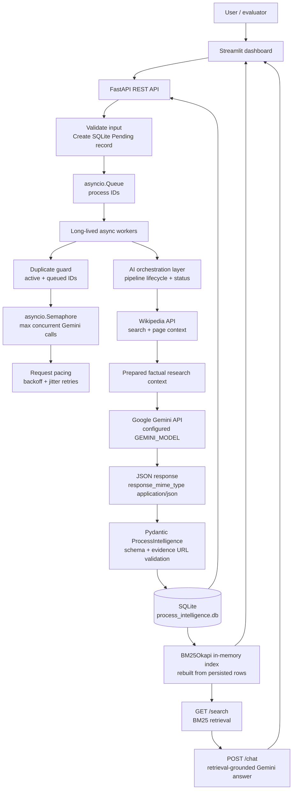

# Architecture

## Layered architecture



GitHub renders the Mermaid diagram above directly in Markdown.

## Execution flow

1. The dashboard sends a process name to `POST /processes` over HTTP.
2. FastAPI validates the name, inserts a unique SQLite row with `Pending`, queues the ID, and returns HTTP 202 immediately.
3. A long-lived worker receives the ID from `asyncio.Queue`.
4. The orchestrator checks the record and marks live in-memory state as Processing for API/dashboard visibility.
5. Wikipedia search tries the exact process name and progressively broader meaningful terms, then retrieves the strongest page context and URL.
6. Gemini receives the process name, factual research context, and source URL. The request uses the Pydantic class directly as `response_schema` and requests JSON MIME output.
7. Pydantic validates the returned 11-dimension profile. The evidence URL must be a verifiable HTTPS Wikipedia URL matching the retrieved source.
8. Validated intelligence is saved to the same SQLite row as `Analyzed`.
9. BM25 is rebuilt from persisted records.
10. Any unrecoverable error updates the row to `Failed`; transient Gemini errors use bounded retries first.
11. Streamlit polls the API and displays the persisted result.

## Orchestration layer

The orchestration layer is implemented in `app.py` by `orchestrate_process_analysis()` and the queue `worker()` function. It coordinates the components but does not replace them:

- Research remains in the Wikipedia component.
- AI generation remains in the isolated Gemini provider function.
- Validation remains in the Pydantic model and evidence validator.
- Persistence remains in the SQLite data layer.
- Retrieval remains in the BM25 component.

The worker architecture uses up to three worker tasks and a separate semaphore that defaults to two concurrent Gemini calls. A small configurable delay spaces request starts. Transient failures such as 429, 500, 502, 503, 504, timeouts, and connection failures receive at least five attempts with exponential backoff and jitter.

## Status and recovery

The conceptual job lifecycle is:

```text
Pending → Processing → Analyzed
                     ↘ Failed
```

The required persisted SQLite schema remains compatible with the project’s three durable database statuses: `Pending`, `Analyzed`, and `Failed`. `Processing` is exposed as live `display_status`/worker state while a worker owns the job, so the database schema and seed contract are not changed. The worker `finally` block always removes active state, and startup recovery resets any legacy persisted `Processing` rows to `Pending` if such rows exist.

## Failure isolation

One failed process is caught and persisted as Failed without terminating the queue. A failed job can be retried individually with `POST /processes/{id}/retry` or in a bounded batch with `POST /processes/retry-failed?limit=10`.

## Scalability boundary

For the challenge, SQLite and an in-process queue are appropriate for a single local FastAPI process. For approximately 1,000 processes, ingestion remains fast because it only writes and queues IDs. Work is controlled by queue depth, worker count, the Gemini semaphore, request pacing, and retries. Production evolution would replace SQLite with PostgreSQL and the in-process queue with a durable broker while preserving the orchestrator and provider boundaries.

## Scaling to 1,000 Processes

The production horizontal architecture is:

```text
API clients
    →
Load Balancer
    →
Multiple FastAPI instances
    →
Shared PostgreSQL database
    →
Shared durable job queue
    →
Multiple AI worker instances
    →
Gemini API
```

In that design, every FastAPI instance remains lightweight: it validates input, persists the process, and publishes a job. A shared durable queue provides cross-instance delivery, visibility timeouts, and recovery. Multiple worker instances consume jobs while a shared concurrency/rate-limit policy protects Gemini. PostgreSQL provides safe concurrent writes and consistent status transitions across API and worker instances.

The current hackathon deployment is intentionally local: one FastAPI instance, SQLite, an `asyncio.Queue`, up to three configurable background workers, and a semaphore that limits concurrent Gemini requests. The SQLite `Pending` rows remain the persistent backlog, while a bounded in-memory queue and dispatcher apply local backpressure. This keeps a burst of 1,000 submissions responsive without starting 1,000 AI calls. The `/load-test/processes` endpoint can create up to 1,000 Pending test records without calling Gemini, and its optional `queue=true` mode still uses the same bounded queue.

### Queue metrics

`GET /stats` exposes:

- `total`
- `pending`
- `processing`
- `analyzed`
- `failed`
- `queue_depth` (bounded queue plus deferred Pending backlog)
- `active_workers`
- `configured_concurrency`

`GET /health` additionally reports only the boolean Gemini readiness signal plus the in-memory queue depth, deferred backlog, and worker count. These metrics make backpressure and gradual queue draining visible during the demonstration without exposing environment secrets.

### Safe load demonstration

This persists 1,000 unique Pending records immediately and makes no Gemini calls:

```powershell
Invoke-RestMethod -Method Post `
  -Uri http://127.0.0.1:8000/load-test/processes `
  -ContentType "application/json" `
  -Body '{"count":1000,"prefix":"Scalability Test Process","queue":false}'
```

The records can then be queued in controlled batches with `POST /processes/queue-pending?limit=5`. This demonstrates ingestion capacity and persistent backlog without an external API flood.
